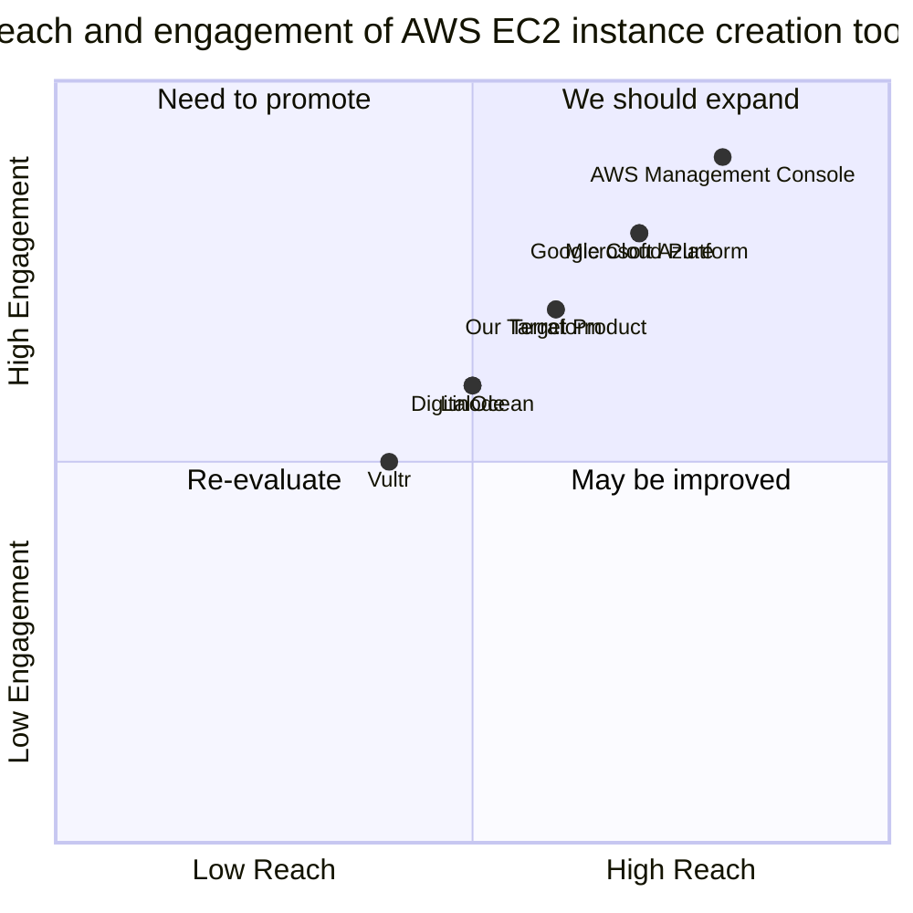

## Original Requirements:
The boss wants you to write a step to create an AWS EC2 instance.

## Product Goals:
- Create a user-friendly interface to easily create AWS EC2 instances.
- Streamline the process of creating AWS EC2 instances.
- Provide clear instructions and guidance throughout the creation process.

## User Stories:
- As a user, I want to be able to select the desired instance type and configuration options.
- As a user, I want to be able to specify the desired storage options for the instance.
- As a user, I want to be able to choose the desired networking settings for the instance.
- As a user, I want to be able to review and confirm the selected options before creating the instance.
- As a user, I want to receive clear feedback and notifications on the progress and status of the instance creation.

## Competitive Analysis:
- AWS Management Console: Provides a comprehensive interface for managing AWS resources, including EC2 instances.
- Terraform: Infrastructure as code tool that allows for the creation and management of AWS resources, including EC2 instances.
- Google Cloud Platform: Offers a similar service to AWS EC2 instances, with its own management console and APIs.
- Microsoft Azure: Provides virtual machines similar to AWS EC2 instances, with its own management portal and APIs.
- DigitalOcean: Offers virtual machines with a simplified interface and straightforward pricing.
- Vultr: Provides high-performance cloud compute instances with a user-friendly interface.
- Linode: Offers cloud instances with flexible configurations and a simple management interface.

## Competitive Quadrant Chart:


## Requirement Analysis:
The product should provide a user-friendly interface to create AWS EC2 instances. It should allow users to select instance types, configure storage options, choose networking settings, and review/confirm their selections before creating the instance. The product should also provide clear feedback and notifications on the progress and status of the instance creation.

## Requirement Pool:
```python
[
    ("Support for multiple regions", "P0"),
    ("Integration with AWS IAM for authentication and access control", "P1"),
    ("Ability to save and reuse instance configurations", "P2")
]
```

## UI Design draft:
The UI should have the following elements and functions:
- Instance Type selection: Dropdown menu to select the desired instance type.
- Configuration options: Input fields or dropdown menus to specify the desired configuration options (e.g., CPU, memory, storage).
- Networking settings: Input fields or dropdown menus to choose the desired networking settings (e.g., VPC, subnet, security groups).
- Review and Confirm: A summary of the selected options for the user to review and confirm before creating the instance.
- Progress and Status: Clear feedback and notifications on the progress and status of the instance creation.

The UI should have a clean and modern style, with a responsive layout that adapts to different screen sizes.

## Anything UNCLEAR:
There are no unclear points.