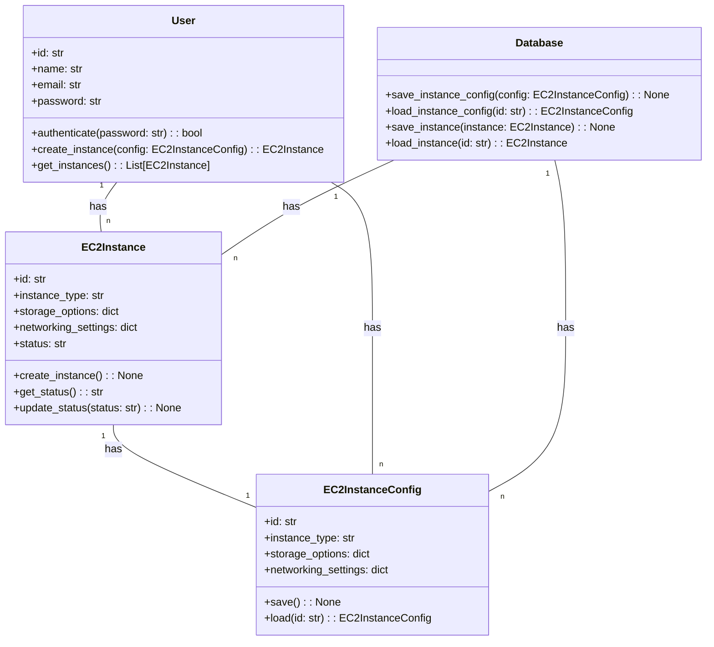
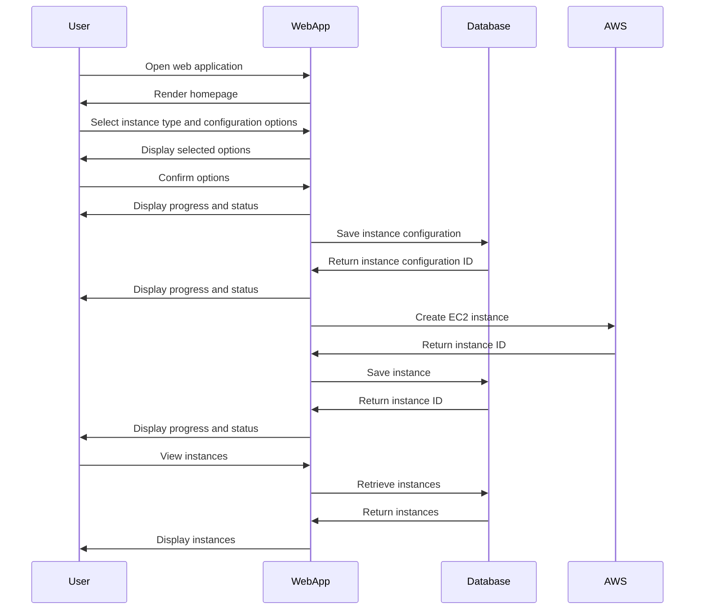

## Implementation approach:
To create a user-friendly interface for creating AWS EC2 instances, we can leverage the AWS SDK for Python (Boto3) to interact with the AWS EC2 API. Boto3 provides a high-level object-oriented API for various AWS services, including EC2.

For the user interface, we can use a web framework like Flask or Django to create a web application. Flask is a lightweight and flexible framework, while Django is a more comprehensive framework with built-in authentication and ORM capabilities. Both frameworks have good community support and are widely used.

To enhance the user experience, we can use a front-end framework like React or Vue.js to create a dynamic and responsive UI. These frameworks provide reusable components and allow for efficient state management.

For styling the UI, we can use a CSS framework like Bootstrap or Tailwind CSS. These frameworks provide pre-designed components and utilities to create a visually appealing and consistent UI.

To handle user authentication and access control, we can integrate with AWS Identity and Access Management (IAM). IAM provides fine-grained access control for AWS resources and supports various authentication methods.

To save and reuse instance configurations, we can use a database like PostgreSQL or MySQL to store the configurations. We can use an ORM like SQLAlchemy to interact with the database and perform CRUD operations.

For clear feedback and notifications on the progress and status of instance creation, we can use a messaging system like RabbitMQ or Apache Kafka. These systems allow for asynchronous communication and can be integrated with the web application to provide real-time updates.

## Python package name:
```python
"aws_ec2_instance_creator"
```

## File list:
```python
[
    "main.py",
    "config.py",
    "models.py",
    "views.py",
    "templates/index.html",
    "static/style.css"
]
```

## Data structures and interface definitions:


## Program call flow:


## Anything UNCLEAR:
The requirements are clear to me.