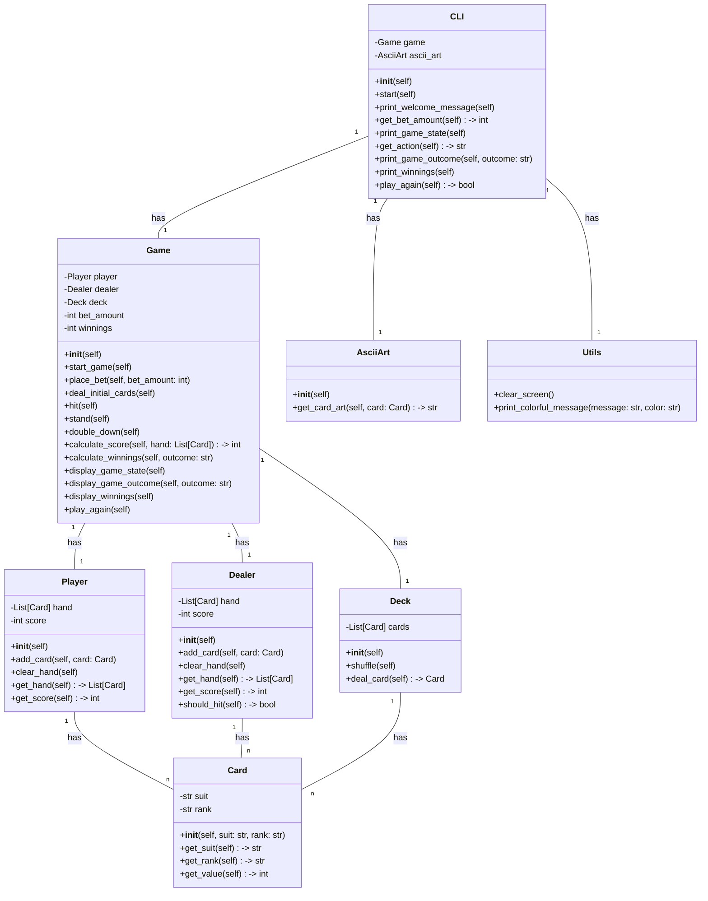

## Implementation approach:
To implement the CLI black jack game, we will use the following open-source tools:

1. Click: A Python package for creating command-line interfaces. We will use Click to handle command-line arguments and options, making it easy for users to interact with the game.

2. ASCII Art: A Python package for creating ASCII art graphics. We will use ASCII Art to display the player's hand and the dealer's hand in a visually appealing way.

3. Random: A built-in Python module for generating random numbers. We will use the random module to shuffle the deck of cards and deal cards to the player and the dealer.

4. Colorama: A Python package for adding color to the command-line output. We will use Colorama to add color to the game messages and make the game more visually appealing.

5. Tabulate: A Python package for creating ASCII tables. We will use Tabulate to display the game outcome and the player's winnings or losses in a tabular format.

By using these open-source tools, we can create a user-friendly CLI black jack game with a robust game logic and an immersive gaming experience.

## Python package name:
```python
"cli_blackjack_game"
```

## File list:
```python
[
    "main.py",
    "game_logic.py",
    "player.py",
    "dealer.py",
    "deck.py",
    "card.py",
    "ascii_art.py",
    "cli.py",
    "utils.py"
]
```

## Data structures and interface definitions:


## Program call flow:
```mermaid
sequenceDiagram
    participant User as U
    participant CLI as C
    participant Game as G
    participant Player as P
    participant Dealer as D
    participant Deck as Dk
    participant Card as Cd
    participant AsciiArt as A
    participant Utils as Ut

    U->>C: Start the game
    C->>G: start_game()
    G->>C: print_welcome_message()
    C->>G: get_bet_amount()
    G->>G: place_bet(bet_amount)
    G->>G: deal_initial_cards()
    G->>C: print_game_state()
    C->>G: get_action()
    G->>G: hit() / stand() / double_down()
    G->>C: print_game_state()
    G->>G: calculate_score(hand)
    G->>G: calculate_winnings(outcome)
    G->>C: print_game_outcome(outcome)
    G->>C: print_winnings()
    C->>C: play_again()
    C->>G: play_again()
    G->>C: start_game()
    C->>G: print_welcome_message()
    ...
```

## Anything UNCLEAR:
The requirements are clear and there are no unclear points.