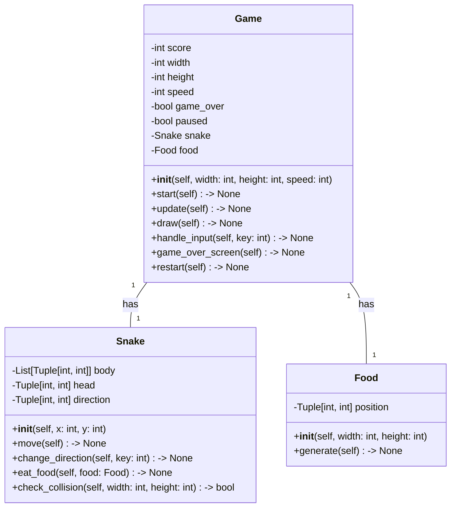
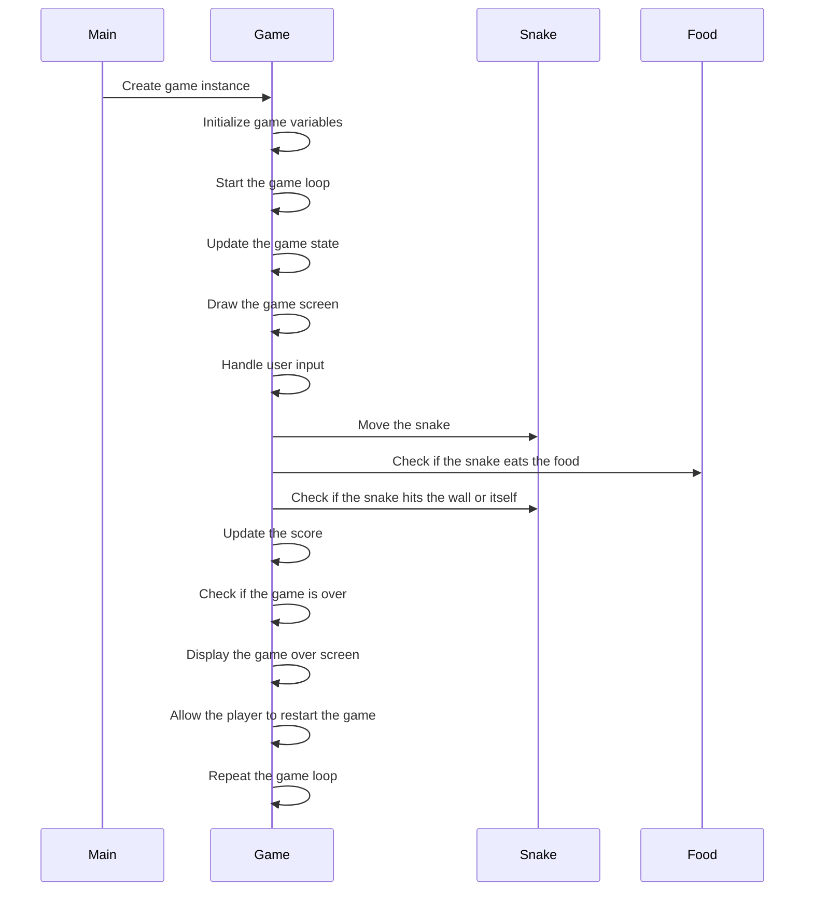

## Implementation approach:

Based on the requirements, we will implement the command-line snake game in Python using the following approach:

1. Use the `curses` library to create a command-line interface for the game.
2. Implement the game mechanics, including snake movement, food generation, and collision detection.
3. Display the game screen, including the snake, food, and score.
4. Handle user input to control the snake's movement using arrow keys.
5. Implement the scoring system and display the player's score on the screen.
6. Handle game over conditions, such as when the snake hits the wall or itself.
7. Allow the player to restart the game after it ends.

## Python package name:
```python
"snake_game"
```

## File list:
```python
[
    "main.py",
]
```

## Data structures and interface definitions:


## Program call flow:


## Anything UNCLEAR:
The requirements are clear to me.